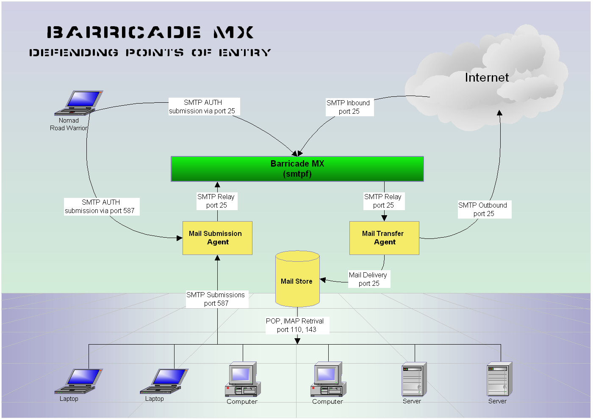

BarricadeMX - An SMTP Filtering Proxy
=====================================

[BarricadeMX](http://software.snert.com/doc/smtpf/) sits in front of one or more MTAs on SMTP port 25.  It acts as a proxy, filtering and forwarding mail to the MTAs, which can be on the same machine or different machines.  By using an independent SMTP pre-filter in the form of a proxy we avoid portability differences and limitations of MTA extension methods (milters, plugins, rule sets, etc.) and tightly couple & integrate tests to improve performance & message throughput.  Requires [LibSnert](https://github.com/SirWumpus/libsnert).

Build & Install From Source
---------------------------

* Install `SQLite` from a package.  Prior to [LibSnert's](https://github.com/SirWumpus/libsnert) availability on GitHub, the old tarballs included SQLite, but GitHub tarballs do not, so it needs to be installed separately.

* [Build LibSnert](https://github.com/SirWumpus/libsnert#configuration--build) first as instructed with the `./configure --without-sqlite3` option at least; it should find the pre-installed version of SQLite.

* Building `smtpf` should be:

        cd com/snert/src
        git clone https://github.com/SirWumpus/smtpf.git
        cd smtpf
        ./configure --help
        ./configure --sysconfdir=/etc --localstatedir=/var [options]
        make
        src/smtpf -info
        src/smtpf -help
        sudo make install

Configuration
-------------

The `smtpf -help` dumps the current configuration and a usage summary (this output can be used for `smtpf.cf`, though one should have been installed already).  A copy of the full documentation is installed locally in `/usr/local/share/doc/smtpf` or see the [online documentation](http://software.snert.com/doc/smtpf/).

* It is possible to run `smtpf` and a MTA on the same host, in which case the MTA has to be reconfigured to listen on a different port since `smtpf` has to listen to SMTP port 25.

Running
-------

A startup script is install based on your OS.  Outside of using your service start/stop commands, `smtpf` can be used directly too; see [command line options](http://software.snert.com/doc/smtpf/runtime.html#command_options).

It is possible to alter some [configuration settings at run time](http://software.snert.com/doc/smtpf/runtime.html#runtime_config), especially logging.

Notes
-----

* BarricadeMX did support Windows native builds using Cygwin / MingW once, but that has not been maintained in a long time and would require some work to restore.  BarricadeMX has yet to be built against the Windows Linux subsystem.

* BarricadeMX development predated Linux's `systemd`, so has not been addressed at this time.
